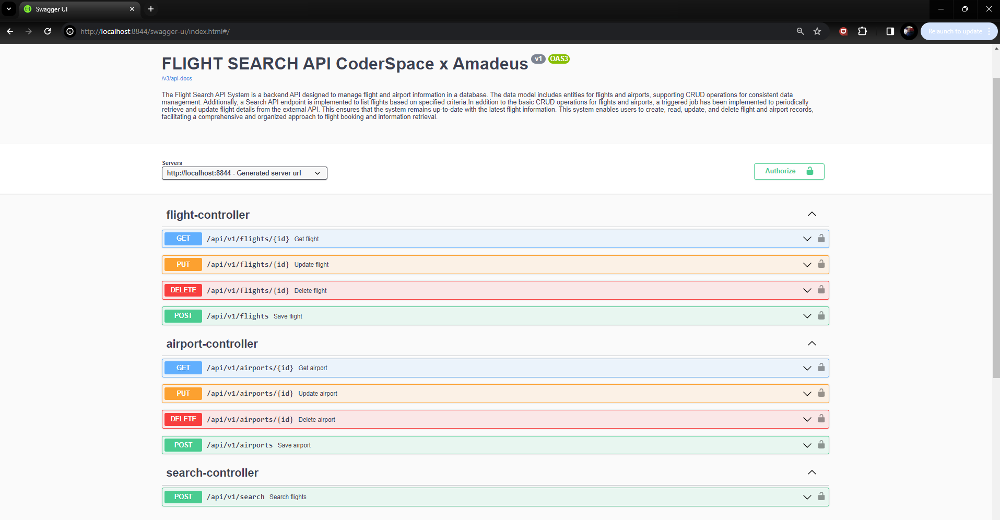

<!-- ABOUT THE PROJECT -->

## CoderSpace x Amadeus Flight Search API

### About Project

The project involves the development of a backend API for a flight search application. The primary goal is to facilitate the management of flight and airport information in a database, implement a CRUD structure for essential operations, create a search API endpoint to list flights based on departure and arrival locations, departure date, and return date. Additionally, the system includes an authentication mechanism, scheduled background jobs for daily updates from a mock third-party API, and version control using Git. The API documentation is to be generated using Swagger.

### 

* JAVA
* Spring Boot
* PostgreSQL
* REST architecture
* Authentication mechanism
* Scheduled background jobs for data updates
* Git for version control
* Swagger for API documentation.

<!-- OUTPUT SCREENSHOTS -->

### Swagger Page of Application

<!-- LICENSE -->
## License

Distributed under the MIT License. See `LICENSE.txt` for more information.

<!-- CONTACT -->

## Contact

### Mehmet Akif Tanisik

  

<!-- PROJECT-BOOTCAMP-PRACTICUM PART -->

 

## Travel to Future - Coderpsace & Amadeus